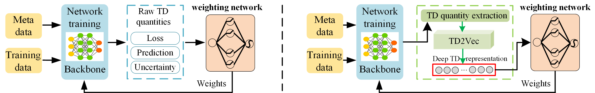

# Official PyTorch implementation for "Delving into the Training Dynamics  for Image Classification". 

## 1. Extraction of TD Quantities

Code for the Extraction of TD Quantities section, see TD_Extraction/README.md for details.

## 2. TD2Vec 

Code for the TD2Vec section, see TD2Vec/README.md for details.

    
    

## 3. Noisy Label Detection 

Code for the noisy label detection section, see noisy_label_detection/README.md for details.

    

## 4. Imbalance Learning 

Code for the imbalance learning section, see imbalance_learning/README.md for details.

