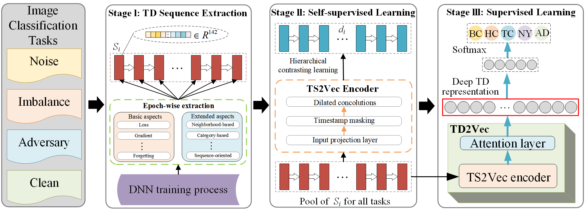

# Official PyTorch implementation for "Delving into the Training Dynamics  for Image Classification". 

## 0. Requirements

- Python 3.6+
- torch=1.8.0+cu111
- torchvision+0.9.0+cu111
- tqdm=4.26.0
- PyYAML=6.0
- einops
- torchsummary

## 1. Extraction of TD Quantities

Code for the Extraction of TD Quantities section, see TD_Extraction/README.md for details.

## 2. TD2Vec 

Code for the TD2Vec section, see TD2Vec/README.md for details.

## 3. Noisy Label Detection 

Code for the noisy label detection section, see noisy_label_detection/README.md for details.

## 4. Imbalance Learning 

Code for the imbalance learning section, see imbalance_learning/README.md for details.
